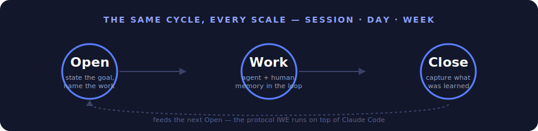

# IWE — Intellectual Work Environment

[](LICENSE)
[](CHANGELOG.md)
[-lightgrey.svg)]()



> The operating system for intellectual work. Your Knowledge. Your Experience. Your Environment — runs on top of any AI platform.
>
> **Repository type:** `Base/Formats` (FMT) — distribution template. After forking, it becomes your personal environment with AI agents.

---

## The Problem

AI assistants can generate text, code, and answers. But most users face the same problems:

- **Context is lost.** Every new AI Session starts from scratch. Yesterday's decisions, plans, and agreements are forgotten.
- **Knowledge stays in your head.** You completed a course, read a book, solved a problem — but a month later you cannot reconstruct your reasoning.
- **AI replaces thinking instead of amplifying it.** You get an answer but do not become more competent. Without AI — back to zero.
- **No system.** Plans are in notes, tasks are in your head, Knowledge is in chat logs. Everything is scattered.
- **Time disappears.** It is unclear what you worked on, what you accomplished, where you are heading.

---

## The Solution: An IDE, But for Thinking

**IWE (Intellectual Work Environment)** is an intellectual work environment.

Just as an IDE brings together an editor, compiler, and debugger into one environment for a programmer — IWE brings together Knowledge, planning, and AI agents into one environment for thinking.

| IDE (for code) | IWE (for thinking) |
|---------------|-------------------|
| Editor → you write code | Exocortex → you capture Knowledge |
| Compiler → checks syntax | Principles → verify decision correctness |
| Debugger → finds errors | ORZ Protocols (Opening→Work→Closing) → find Knowledge and context losses |
| Linter → improves quality | ArchGate → evaluates architectural decisions |
| Git → change history | Strategist → work history and planning |

> **Core principle: exoskeleton, not prosthetic.** IWE amplifies your thinking — it does not replace it. After every Session you become more competent, not merely get a result. See: [principles-vs-skills.md](docs/principles-vs-skills.md).

## Key IWE Terms

| Term | What It Is |
|--------|---------|
| **Exocortex** | Your external Memory — files with plans, context, and conclusions that Claude reads in every Session |
| **Pack** | A formalized Knowledge base for your Domain — the single source of truth for domain knowledge |
| **ORZ** | Opening → Work → Closing — a ritual for every Session and every day; prevents context loss |
| **ArchGate** | Structured Assessment of architectural decisions across 7 characteristics (instead of "I think this is fine") |
| **Strategist** | An AI agent that automatically drafts day/week plans and tracks Progress |


---

## Work Culture — A New Way to Interact With AI


### The ORZ Protocol (Opening → Work → Closing)

Every Session and every day passes through three stages:

- **Opening** — Claude checks the plan, identifies the task, and aligns on the approach. You do not start work "from scratch" — the AI knows the context.
- **Work** — during the work, Claude captures valuable Knowledge (Capture-to-Pack). Insights are not lost.
- **Closing** — the result is captured, the plan is updated, and the next Session starts from where you left off.

Skipping Opening = unplanned work. Skipping Closing = lost result.

### Exocortex — External Memory

Your Knowledge, principles, Distinctions, plans, and context are stored in files that Claude reads in every Session. This is not a "prompt" — it is an **accumulated base** that grows with you.

### Knowledge Formalization (Pack)

What you learn does not stay in your head. Valuable Knowledge is formalized into a Pack — a Domain passport. Pack is the single source of truth for domain knowledge. See: [LEARNING-PATH.md](docs/LEARNING-PATH.md).

---

## Who It Is For

Every professional drowns in information: 12+ tools (Notion, Google Docs, Slack, ChatGPT, courses...), Knowledge is scattered, nothing is connected. AI answers questions but does not know *your* context — every time from scratch.

IWE is for those who want to change that:

- **Entrepreneurs and managers** — you strategize, make decisions, and manage projects. IWE provides a system: from weekly planning to Domain Knowledge formalization.
- **Engineers and developers** — you work with code and Architecture. IWE preserves context between Sessions; the AI knows your codebase, technical debt, and Roadmap.
- **Researchers and analysts** — you study, synthesize, and publish. IWE turns scattered notes into a structured Knowledge base that grows with you.
- **Anyone who does intellectual work** — and wants a **symbiosis with AI**, not dependence on it. An exoskeleton for thinking, not a prosthetic.

---

## Use Cases

### Work Projects

| Scenario | What Happens | Details |
|----------|---------------|-----------|
| **Product development** | Claude knows the Architecture, technical debt, and Roadmap. Every Session is a continuation, not a restart from scratch. | [SC.013](docs/use-cases/USE-CASES.md#sc013-рабочая-сессия-с-claude-code), [SC.015](docs/use-cases/USE-CASES.md#sc015-развитие-системы-ds) |
| **Documentation maintenance** | Knowledge is captured into Pack during work. No need to "write the docs later" — they are written during work. | [SC.004](docs/use-cases/USE-CASES.md#sc004-фиксация-и-экстракция-знаний), [SC.014](docs/use-cases/USE-CASES.md#sc014-формализация-знаний-pack) |
| **Project coordination** | WeekPlan, DayPlan, Work Product registry — the Strategist helps plan and track Progress. | [SC.001](docs/use-cases/USE-CASES.md#sc001-планирование-дня), [SC.002](docs/use-cases/USE-CASES.md#sc002-планирование-и-ревью-недели) |
| **Review and Refactoring** | ArchGate evaluates decisions across 7 characteristics. Not "I think this is fine" — a structured Assessment. | [SC.015](docs/use-cases/USE-CASES.md#sc015-развитие-системы-ds) |

### Personal Development

| Scenario | What Happens | Details |
|----------|---------------|-----------|
| **Taking a course** | Claude helps capture key ideas, asks questions to verify Understanding, and connects new material to what you already know. | [SC.003](docs/use-cases/USE-CASES.md#sc003-обучение-и-развитие) |
| **Writing articles** | A creative Pipeline: note → draft → outline → publication. Every Artifact is tracked. | [SC.005](docs/use-cases/USE-CASES.md#sc005-публикация-контента) |
| **Strategizing** | A weekly Session: Review of the past week, planning the new one, alignment with goals. The Strategist prepares a draft — you make the decisions. | [SC.011](docs/use-cases/USE-CASES.md#sc011-стратегирование) |
| **Building a Knowledge base** | Your Pack grows. After six months you have a formalized Domain Knowledge base, not a collection of notes. | [SC.014](docs/use-cases/USE-CASES.md#sc014-формализация-знаний-pack) |

> Full catalog of 15 scenarios: **[USE-CASES.md](docs/use-cases/USE-CASES.md)**

---

## What It Looks Like in Practice

- In the morning — the Strategist has drafted a plan: a Telegram notification + a DayPlan file in the Repository.
- You open VS Code → `claude` → Claude knows what is in the plan and suggests starting with the top Priority.
- You work — Claude captures Knowledge along the way (Capture-to-Pack).
- You close the Session — the result is captured, the plan is updated.
- On Monday — the Strategist prepares a draft weekly plan; you discuss it in a strategizing Session.

---

## Getting Started

**Quick start** (Git, Node.js, Claude Code already installed): **[QUICK-START.md](docs/QUICK-START.md)** — 15 minutes to your first Session.

**Full installation** from a clean machine: **[SETUP-GUIDE.md](docs/SETUP-GUIDE.md)** — 30–60 minutes including all dependencies.

**Not on macOS or not using Claude Code?** See **[PORTABILITY.md](docs/PORTABILITY.md)** — instructions for Kimi Code, Hermes Agent, and others.

**Using a different agent or LLM?** IWE is not tied to Claude. If your agent can see files in the repo folder and edit files, it will work. How to connect → [PORTABILITY.md](docs/PORTABILITY.md).

```bash
mkdir -p ~/IWE && cd ~/IWE
gh repo fork iwesys/IWE --clone
cd FMT-exocortex-template
bash setup.sh
```

After installation:

```bash
cd ~/IWE
claude
```

Tell Claude: **"Let's run our first strategic Session"** — and it will guide you through defining goals, creating your first plan, and configuring the Environment.

---

## Customization

IWE updates like a distribution — you receive Platform updates without losing your settings.

**Extensions (extensions/)** — add your own blocks to Protocols:

```bash
# Add end-of-day reflection
echo "## Day Reflection
- What was difficult?
- What would I do differently?
- What deserves praise?" > extensions/day-close.after.md
```

**Parameters (params.yaml)** — enable or disable Protocol steps:

```yaml
reflection_enabled: true    # Enable reflection
video_check: false          # Disable video check
multiplier_enabled: true    # IWE multiplier
```

**Updates** — `bash update.sh` updates the Platform while preserving your extensions/, params.yaml, and edits in CLAUDE.md (3-way merge).


---

## Documentation

| Document | Contents |
|----------|-----------|
| **[Beginner's Guide](docs/onboarding/onboarding-guide.md)** | Start here if you are new to IWE. What it is, why it exists, what it consists of — no technical jargon. |
| **[Quick Start](docs/QUICK-START.md)** | 15 minutes from `git clone` to your first Session. For those who already have Git and Claude Code. |
| **[SETUP-GUIDE.md](docs/SETUP-GUIDE.md)** | Step-by-step installation from a clean machine. Requirements, modes (core/full), verification. |
| **[LEARNING-PATH.md](docs/LEARNING-PATH.md)** | The IWE learning path: Architecture, principles, Protocols, Pack, Roles. |
| **[DATA-POLICY.md](docs/DATA-POLICY.md)** | Data policy: what is collected, where it is stored, how to delete it. |
| **[DATA-RESIDENCY.md](docs/DATA-RESIDENCY.md)** | The residency principle: data you bring into IWE from outside (health, calendar, working hours) — where it may and may not go. |
| **[IWE-HELP.md](docs/IWE-HELP.md)** | Quick reference and FAQ. |
| **[principles-vs-skills.md](docs/principles-vs-skills.md)** | Why principles matter more than Skills: the generative hierarchy. |
| **[CHANGELOG.md](CHANGELOG.md)** | Template change history. |

> Two documents cover related topics: `DATA-POLICY.md` covers data the Platform collects about you; `DATA-RESIDENCY.md` covers data you bring into IWE from outside.

---

## FAQ

**Q: Is an Anthropic subscription required?**
A: For the full installation (Claude Code) — Claude Pro ($20/month) is recommended. If needed, you can upgrade to Claude Max (~$100/month) for unrestricted use. For the minimal installation (`setup.sh --core`) — works with any AI CLI. See: [SETUP-GUIDE.md](docs/SETUP-GUIDE.md).

**Q: Does it work with other AI systems (not Claude)?**
A: Yes, three agents are supported out of the box:
- **Claude Code** — full support: reads `CLAUDE.md`, all Skills and Hooks work.
- **Kimi Code** (VS Code) — reads `AGENTS.md` automatically when the repo is opened. Customization: `extensions/` or `AGENTS-agent-blocks.md`. Skills (`/day-open` etc.) via Claude Code.
- **Hermes Agent** — connect Aisystant MCP through Hermes settings and it receives instructions automatically.

For other agents (Cursor, Copilot, Gemini) adaptation is required. See: [PORTABILITY.md](docs/PORTABILITY.md).
The minimal installation (`setup.sh --core`) works without binding to a specific agent.

**Q: Does it work on Linux/Windows?**
A: Yes. The core works on any OS. Strategist automation: macOS — launchd, Linux — cron, Windows — WSL. See: [SETUP-GUIDE.md](docs/SETUP-GUIDE.md).

**Q: What if the computer is off or asleep — will automation stop?**
A: Cloud Scheduler (GitHub Actions) runs in the cloud even when the computer is off. For local agents: Scripts automatically prevent sleep during operation (macOS: `caffeinate`, Linux: `systemd-inhibit`). For laptops, it is recommended to configure automatic wake and disable idle sleep — see [SETUP-GUIDE.md](docs/SETUP-GUIDE.md).

**Q: What is a Pack?**
A: A formalized Knowledge Domain — the single source of truth for domain knowledge. See: [LEARNING-PATH.md](docs/LEARNING-PATH.md).

**Q: Is my data secure?**
A: Three protection zones: local, GitHub (private repositories), Platform (per-user isolation). See: [DATA-POLICY.md](docs/DATA-POLICY.md).

**Q: How is IWE different from Obsidian / Notion / Logseq?**
A: Obsidian is a note storage tool. IWE is a **work environment** with Protocols, AI agents, and Knowledge formalization. You can use Obsidian inside IWE for notes, but IWE provides structure, planning, and Competency accumulation.

**Q: Is programming required?**
A: No. The template is a ready-made Configuration. Installation is via setup.sh. Work is done through Claude Code in natural language.

**Q: Can it be used without the Strategist?**
A: Yes. Claude Code + CLAUDE.md + memory/ work fully on their own. The Strategist is planning automation. Without it, you plan manually.

**Q: How do I set the strategizing day?**
A: In `memory/day-rhythm-config.yaml`, change `strategy_day: sunday` to the desired day. See: [LEARNING-PATH.md](docs/LEARNING-PATH.md).

**Q: The clone ended up in `~` instead of `~/IWE`?**
A: All installation commands must be run in the same terminal. Opening a new terminal starts from `~`. Delete the folder from `~` and repeat from `cd ~/IWE`. See: [SETUP-GUIDE.md](docs/SETUP-GUIDE.md).


---

## IWE Community

IWE is an Environment you build alone. But you develop it together.

The **IWE Community** is a closed chat for Practitioners who work within the same system: ORZ, Pack, Exocortex. A place where the discussion is not "how to prompt better" — but how to build intellectual work seriously.

### What Happens There

- **Work Product reviews** — participants share real Packs, plans, and Retrospectives. They receive feedback from people who understand what "Closing without capturing the result" means.
- **IWE installation and customization Experience** — what broke, how it was fixed, which extensions proved useful.
- **Method discussions** — the ORZ fractal, ArchGate, Capture-to-Pack in Practice: what works, where theory diverges from reality.
- **Links and discoveries** — tools, patterns, SOTA that fit the IWE philosophy.

### Why This Matters

You can study the system alone. But most questions arise during application: "How do I formalize this Knowledge Domain?", "Am I using ORZ correctly?", "Who has Experience with this tool?"

In the community, these questions get answers from people who have already been through it.

### Free Channels

- [GitHub Discussions](https://github.com/iwesys/IWE/discussions) — questions, ideas, share your setup.
- [Issues](https://github.com/iwesys/IWE/issues) — bug reports and feature requests.

### Closed Community (Telegram)

Deep Practice, Work Product reviews, direct support. Entry — through the **"IWE for Practitioners"** seminar (5000₽) via the [@aist_me_bot](https://t.me/aist_me_bot) bot.

---

## Contributing

See [CONTRIBUTING.md](CONTRIBUTING.md) — how to contribute to the project.

**IWE team developers (level T4+):** the single entry point is [Developer Onboarding](docs/developer/). In 10 minutes you will understand the development Pipeline (6 stations, dual output) and complete your first task.

---

## License

MIT