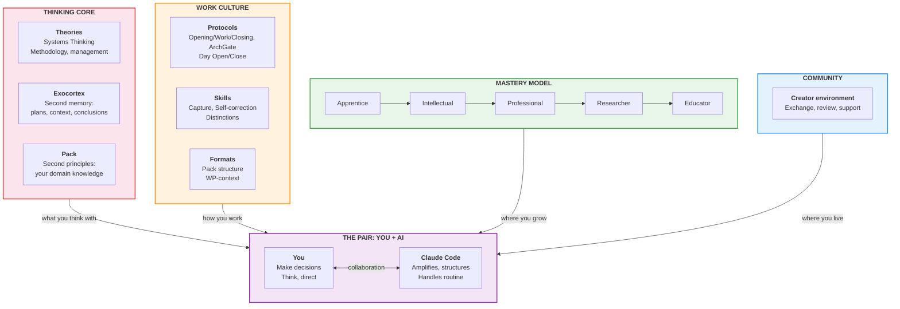
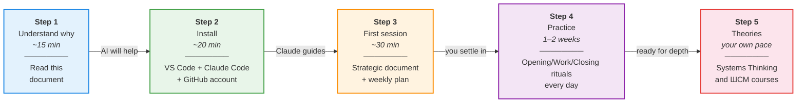
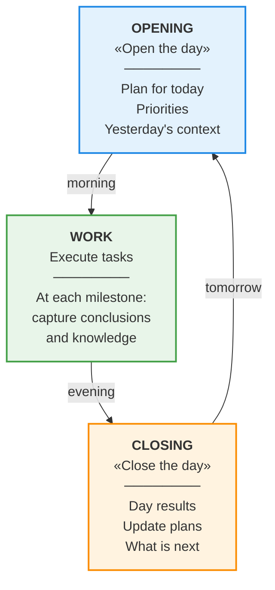
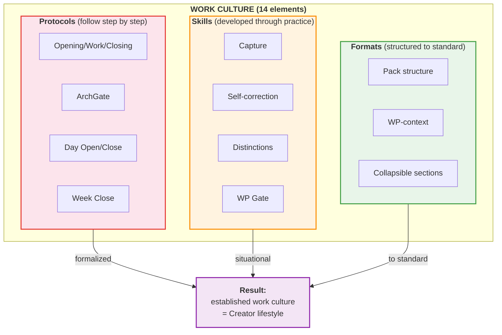
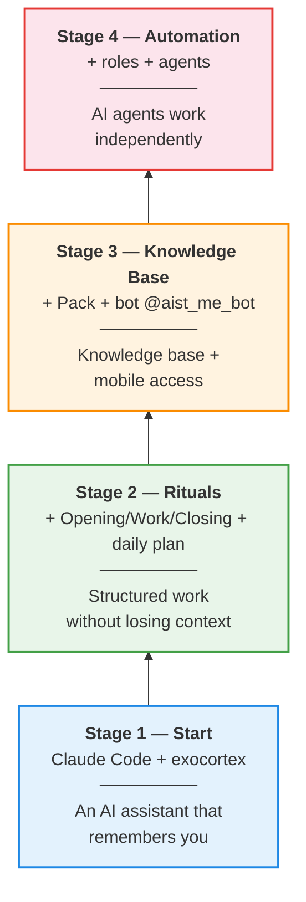
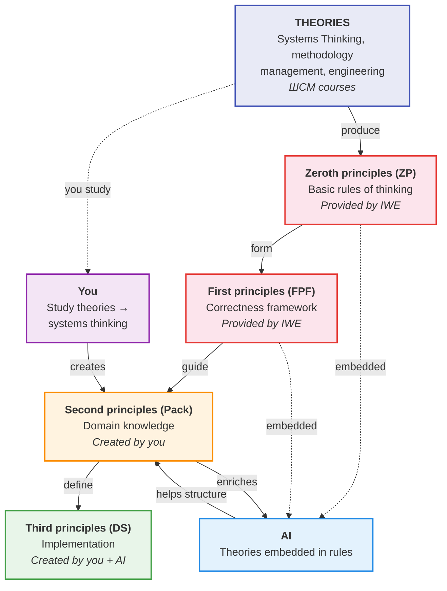
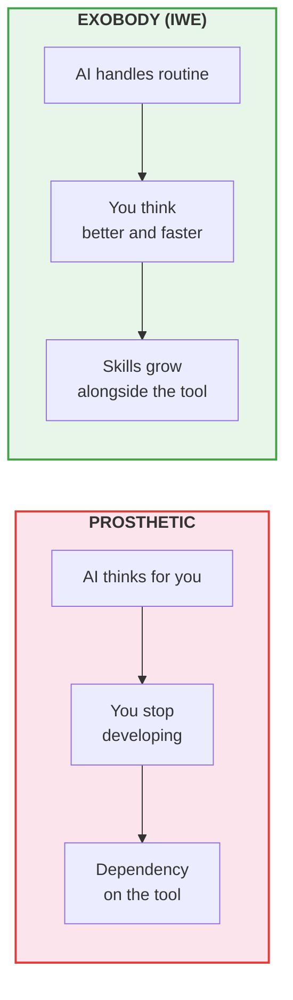
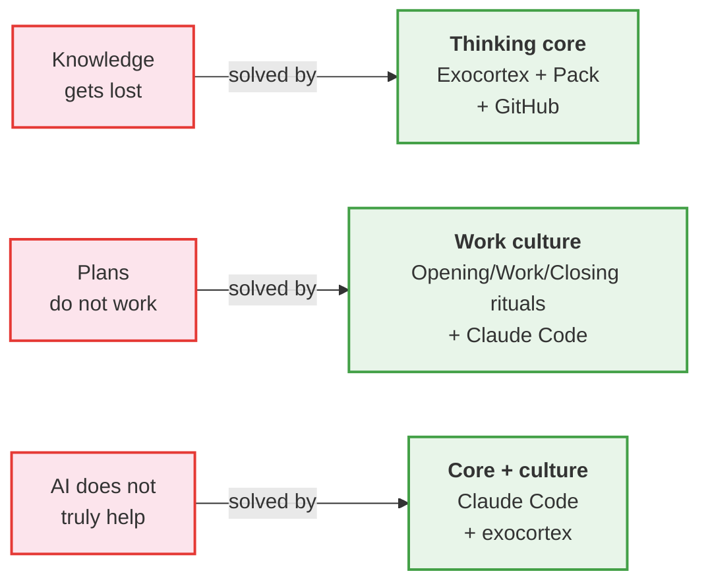

# IWE Visual Diagrams for Beginners

> Diagrams in Mermaid format. Rendered in GitHub, VS Code (with the Mermaid extension), and most Markdown editors.

---

## Diagram 1. Four IWE Components

> IWE = OS for intellectual work. Four components, you at the center, tools are delivery mechanisms.

---

## Diagram 2. User Journey: From Zero to a Working IWE

> Five steps. Each step produces a concrete result.

---

## Diagram 3. Opening/Work/Closing Ritual (Daily Cycle)

> One pattern for the day and for each work session.

---

## Diagram 3.5. Work Culture — Three Element Types

> 14 elements of IWE work culture, divided into three types. Culture is what you get paid for.

---

## Diagram 4. IWE Connection Path (Local Environment Setup)

> Start with Stage 1. Add components as you are ready. This is building your own environment — not an access tier (T0→T4, DP.ARCH.002) and not a Mastery stage (FORM.089).

---

## Diagram 5. Theories → Principles → Practice

> IWE is grounded in theories (ШСМ). Theories produce principles. Principles are embedded in the AI and studied by you.

---

## Diagram 6. Exobody vs Prosthetic

> The key IWE distinction: AI **extends** thinking, it does not **replace** it. IWE = an exobody for thinking.

---

## Diagram 7. Problem → Solution

> Mapping between common problems and IWE components.

---

*Created: 2026-03-17 | Updated: 2026-03-27 | WP-120 | [FMT-exocortex-template](https://github.com/TserenTserenov/FMT-exocortex-template)*